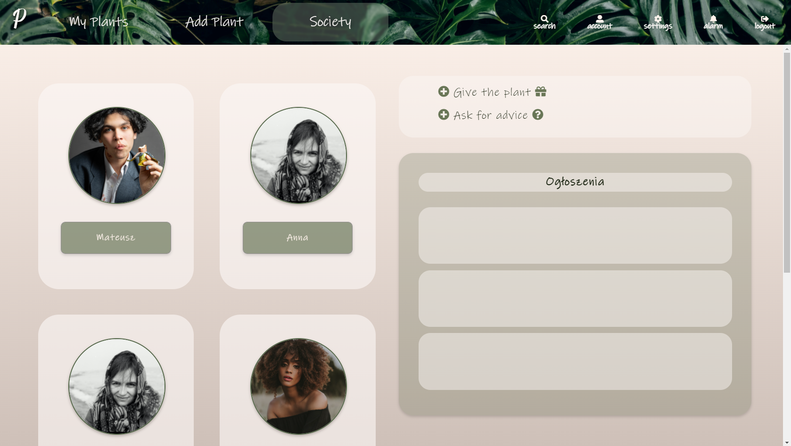

# Plantcherish

## Podstawowe informacje
Projekt w zamyśle prezentuje aplikacje, która ma na celu przypominanie o cyklicznej pielęgnacji roślin,  zawiera historyczne na temat pielęgnacji konkretnych roślin oraz umożlwia dzielenie się poradami pomiędzy różnymi użytkownikami.

## Opis 

Specyfika aplikacji:
* Większość wymiarów strony jest dopasowana korzystając z wymiarowania za pomocą vh oraz vw. Dla poszczególnych widoków wykonano dwie możliwości wymiarów aplikacji, dostosowanej do ekranu komputerowego oraz smartfona.
* Po otworzeniu strony startowej pojawia się opcja logowania lub utworzenia konta dla niezarejestrowanych użytkowników. Strona posiada weryfikację loginu i hasła, które musi spełniać wymagania posiadając co najmniej jedną wielką literę oraz cyfrę. O ewentualnych błędach użytkownik jest powiadamiany banerem znajdującym się nad obszarem logowania.
* Po poprawnym zalogowaniu zostaje wyświetlona strona startowa aplikacji, która przedstawia przegląd pielęgnacji roślin użytkownika.
* Użytkownik może wybrać z menu znajdującego się górnym banerze, do jakiej podstrony ma zamiar się udać. Ma do wyboru: stronę "My Plants", "Add Plant", "Society". Po prawej stronie baneru znajduje się także pole wyszukiwania, ustawienia konta oraz ustawienia powiadomień.
* Zakładka "My plants" wyświetla wszystkie rośliny użytkownika wraz ze zdjęciem oraz imieniem. Po wybraniu poszczególnej z nich zostaje wyświetlona strona danej rośliny, która przenosi ją do podstrony "Treatment". Przedstawia ona jej dane osobowe, historię działań oraz ustawienia planowanych akcji.
* Podstrona "Society" wyświetla innych użytkowników oraz tablicę ogłoszeń, które dotyczą problemu z rośliną albo opcję adopcji innej rośliny.
* Użytkownicy w ramach własnego profilu mogą zmienić nazwę, dane osobowe oraz hasło.
* Opcja wylogowania umożliwia wylogowanie użytkownika z aplikacji oraz następuje powrót do strony startowej logowania.

Opis projektu względem kryteriów ewaluacji projektu:

1. Zawarta jest dokumentacja w README.MD
2. Część backendowa jest napisana obiektowo
3. Diagram ERD został dodany
4. Systematyka pracy GIT: Po wykonaniu większej pracy, aktualizowano repozytorium
5. Realizacja tematu: Prototyp aplikacji wysłany wcześniej obejmował rozszerzoną funkcjonalność, więc aplikacja wymaga uzupełnienia w przyszłości.
6. Plik nav.php są otwierane na każdej podstronie, aby zapobiec powtarzających się widoków.
7. Połączenie z bazą PostgreSQL
8. Baza danych zawiera relacje jeden do jednego oraz jeden do wielu
9. Wersja PHP 7.4.3
10. Zastosowano język Javascript w celu walidacji formularzy
11. Wykorzystanie metody POST i GET
12. Główne style zawarte w pliku style.css, reszta w plikach do każdej podstrony (np. settings.php -> settings.css)
13. Stworzono 5 widoków, pokazujących responsywność strony dla dwóch typów urządzeń (PC, Smartfon). Wykorzystanie media queries
14. Przy logownaiu sprawdzany sprawdzany jest format email, a hasło musi zawierać minimum: 1 literę dużą, 1 literę małą oraz 1 cyfrę.
15. Wartości sesji są zaimplementowane i kasowane po wylogowaniu
16. Użytkownik niezalogowany nie ma dostępu do wszystkich podstron
17. Role jakie użyłem to użytkownik zalogowany i niezalogowany - z dostępem do odpowiednich podstron z użyciem sesji
18. Wylogowanie
19. Stosuję m.in. left join na tabeli Users oraz Plants
20. Hasła są hashowane
21. Powtarzalny kod jest zawarty w pliku oraz nav.php
22. Czystość i przejrzystość kodu
23. Baza danych zrzucona do pliku .sql

##Diagram ERD

##Widoki
* PC

*smartfon

